```Запуск проекта и его техническое задание```

1. Описание класса: 

    1. [KafkaConfig.java](src%2Fmain%2Fjava%2Fcom%2Fexample%2Fkafka%2Fconfig%2FKafkaConfig.java) Класс отвечает за конфигурацию Kafka.
    2. [AlertController.java](src%2Fmain%2Fjava%2Fcom%2Fexample%2Fkafka%2Fcontroller%2FAlertController.java) Контроллер принимает оповещения о сбоях с клиента Alertmanager.
    3. [ClientRestController.java](src%2Fmain%2Fjava%2Fcom%2Fexample%2Fkafka%2Fcontroller%2FClientRestController.java) Контроллер обращается к базе данных Elasticsearch и запрашивает товар по его имени.
    4. [ShopRestController.java](src%2Fmain%2Fjava%2Fcom%2Fexample%2Fkafka%2Fcontroller%2FShopRestController.java) Класс отвечает как за создание товаров, так и за создание запрещённых товаров
    5. [ShopProducerService.java](src%2Fmain%2Fjava%2Fcom%2Fexample%2Fkafka%2Fservice%2Fproducer%2FShopProducerService.java) Класс создаёт записи о товарах в Kafka.
    6. [StatisticProducerService.java](src%2Fmain%2Fjava%2Fcom%2Fexample%2Fkafka%2Fservice%2Fproducer%2FStatisticProducerService.java) Класс записывает данные в Kafka о пользовательских запросах по поиску товара.
    7. [ShopFilterService.java](src%2Fmain%2Fjava%2Fcom%2Fexample%2Fkafka%2Fservice%2Fstream%2FShopFilterService.java) Класс отвечает за потоковую обработку данных топика shop-candidate и фильтрацию товаров по списку запрещённых.
    8. [AnalysisServiceClient.java](src%2Fmain%2Fjava%2Fcom%2Fexample%2Fkafka%2Fservice%2FAnalysisServiceClient.java) Класс считывает данные из кластера, куда реплицируются данные, и сохраняет их в хранилище HDFS. Там же Spark читает данные из HDFS и составляет рекомендации для пользователей по популярным категориям.
    9. [ShopService.java](src%2Fmain%2Fjava%2Fcom%2Fexample%2Fkafka%2Fservice%2FShopService.java) Отвечает за поиск товаров в Elasticsearch.


<br>
<br>


```Все команды выполняются в root-папке приложения. Команды выполняются по порядку..```


1. Выполнить команду для сборки исходников приложения ```./mvnw clean package```

<br>
<br>

2. Выполнить команду по запуску docker-compose ```docker-compose up -d```

<br>
<br>

3. Выполнить команду по выдаче прав ACL пользователям на топики ```./acl_permission.sh```

<br>
<br>

4. Выполнить команду по созданию задачи на коннекторе elasticsearch-sink ```./create_elasticsearch_sink.sh```

    1. Данная задача будет записывать данные в Elasticsearch из топика `shop`
    

<br>
<br>

5. Выполнить команду, которая создаст в топике `shop-blocked` список запрещённых товаров ```./send_requests_create_shop_blocked.sh```

    1. Переходим в UI по адресу http://localhost:8085/, в категорию Topics, заходим в топик `shop-blocked`. Там должны быть три записи о запрещённых товара. `USB-C Cable, Bluetooth Speaker, Fitness Tracker`
    2. 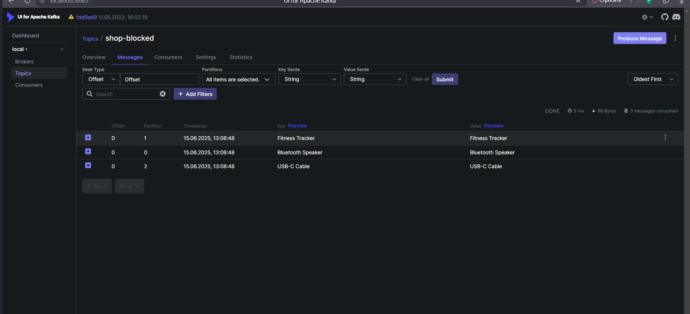 

<br>
<br>

6. Выполнить команду, которая должна создать в топике `shop-candidate` 10 записей товаров  ```./send_requests_create_shop.sh```

    1. Переходим в UI по адресу http://localhost:8085/, в категорию Topics, заходим в топик `shop-candidate`. Там должно быть 10 записей о товарах.
    2. 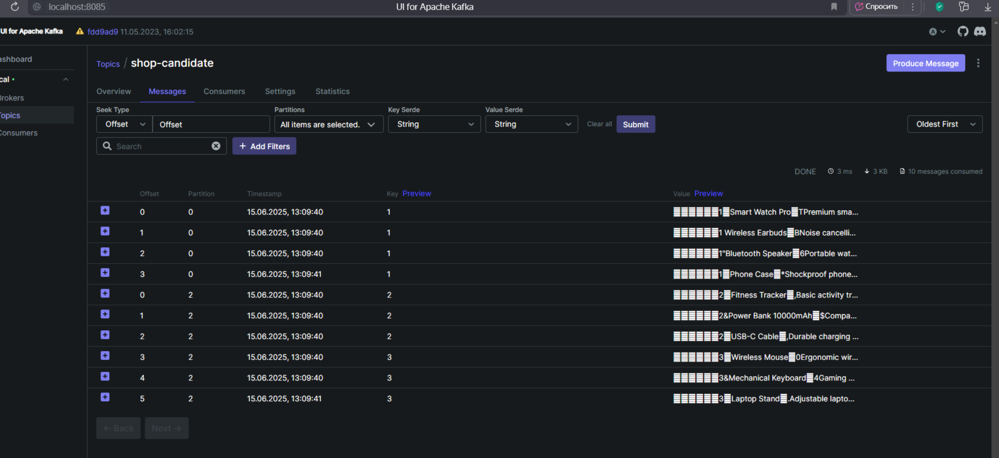

<br>
<br>

7. Так как у нас настроена потоковая обработка сырых данных товаров, будет запущена фильтрация, и в топик `shop` попадут только 7 товаров, так как 3 из них находятся в запрещённом списке.

    1. Переходим в UI по адресу http://localhost:8085/, в категорию Topics, заходим в топик `shop`. Там должно быть 7 записей о товарах.
    2. 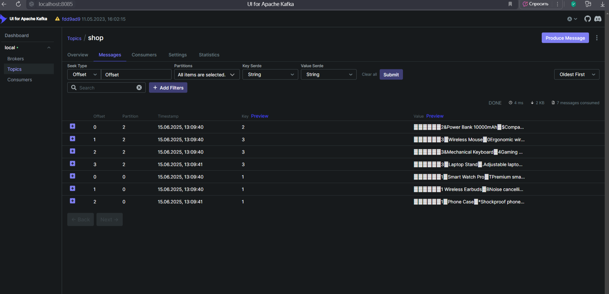

<br>
<br>

8. Должна происходит репликация данных в другой кластер двух топиков shop и statistic-client.

    1. Переходим в UI кластера, куда реплицируются данные топики по адресу http://localhost:7085/, в категорию Topics, заходим в топик `shop`. Там должно быть 7 записей о товарах который прошли фильтрацию.
    2. 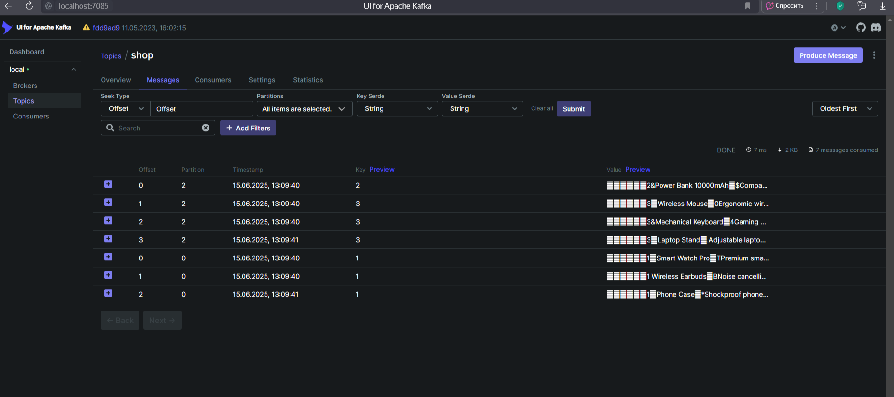

<br>
<br>

9. Выполнить команду по имитации запросов клиентов о товарах по имени `./send_requests_get_shop.sh`

    1. На основе этого запроса будет собрана статистика о самой запрашиваемой популярной категории для клиента. Инструмент Spark и рекомендации будут записаны в топик `client-recommendations` на CLUSTER-DESTINATION.
    2. Переходим в UI кластера, куда реплицируются данные по адресу http://localhost:7085/, в категорию Topics, заходим в топик `client-recommendations`. Там должно быть записей о рекомендациях по категориям для пользователей.
    3. Если рекомендации пришли не для всех пользователей, повторите запрос ./send_requests_get_shop.sh.
    4. 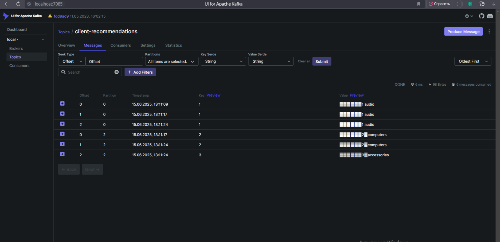

<br>
<br>


10. Так общая статистика пользователей о их поисковых запросах.

   1. 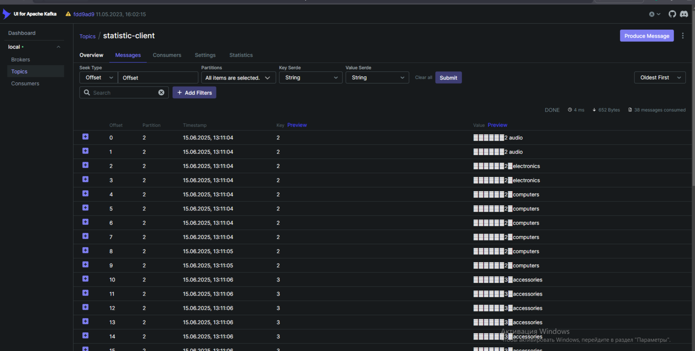
   1. 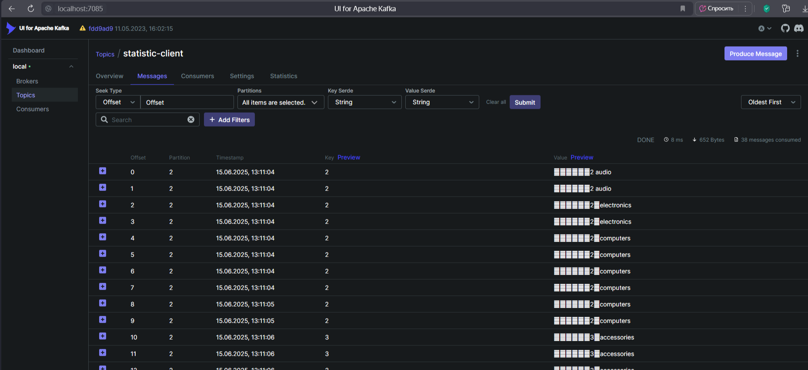


<br>
<br>


11. Grafana настроена на отображение метрик как кластера, так и отдельных брокеров.

   1. Заходим на UI http://localhost:3000 в раздел Dashboard. Заходим в конкретный Dashboard для просмотра графиков. 
      1. СБор метроиков с брокера:  
         1. rate(kafka_server_messages_in_per_sec{instance="kafka-1-destination:7071"}[5m]) Средняя скорость входящих сообщений в брокер (со скоростью сообщений в секунду), усреднённая за последние 5 минут.
         2. rate(kafka_server_bytes_in_per_sec{instance="kafka-1-destination:7071"}[5m]) Средняя скорость входящих байт (трафика) в брокер, усреднённая за 5 минут.
         3. kafka_server_under_replicated_partitions{instance="kafka-1-destination:7071"}  Количество партиций, которые в текущий момент имеют недостаточное количество реплик (т.е. данные не полностью реплицированы).
         4. kafka_network_processor_idle_percent{instance="kafka-1-destination:7071"} Процент времени, когда сетевой процессор Kafka был в состоянии простоя (idle). Высокое значение — значит, что процессор не перегружен.
      2. 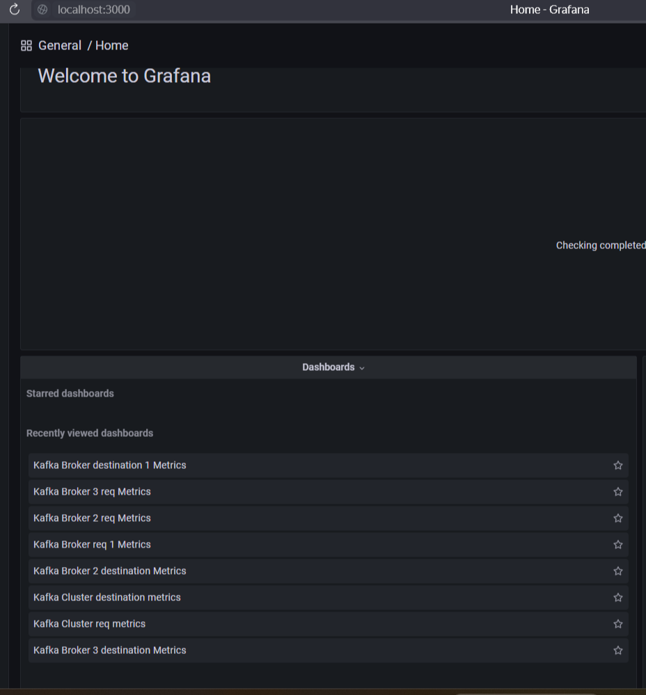
      3. 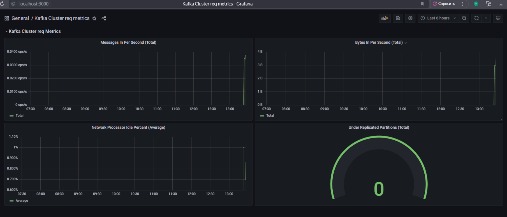
      4. 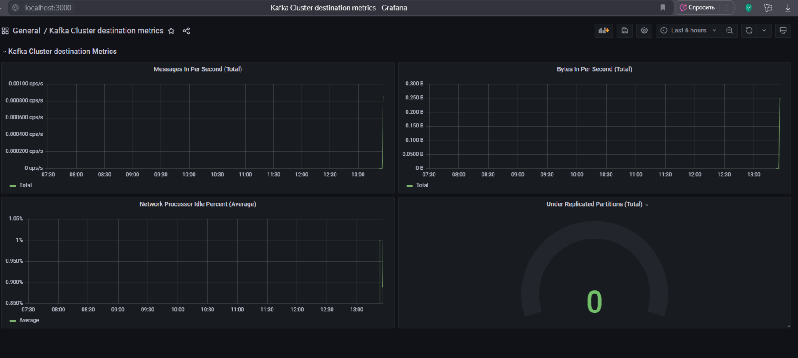


<br>
<br>


   
12.  Prometheus настроен на сбор метрик с каждого кластера.
   
   1. 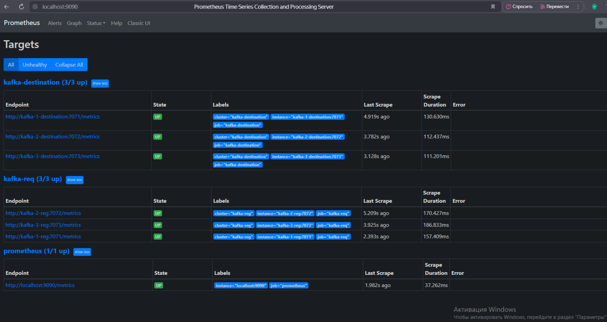
   2. К Prometheus подключён Alertmanager. Это пример правил оповещений (alerting rules) для Prometheus, которые мониторят состояние Kafka  по  правилу:
      Если брокер недоступен (up == 0) более 1 минуты, срабатывает алерт KafkaBrokerDown и приходит оповещение на URL http://app:8090/api/alerts.»
